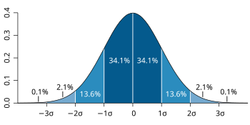

Nowadays you always see people use - mostly - ChatGPT to do everything, from homework to just search for random stuff. I am fine with LLM's, though the way
they train them is not correct at all. The gaussian distribution exist everywhere in life and this is the reason - or one of the reasons - that the code produced
by GPT, Perplexity or other models is completely shit.

It's logicall to tell that there are not many good programmers out there, this is what the gaussian distribution shows. The average exist in the middle, on your
left you have the bad ones and on your right the 10x developers(i hate this 10x thing). Obviously the "average" data overshadows the "good" data, but there's not a lot you can
do about it. This semester at my university it's like every single computer science professor is being told to push us into using Chat GPT specifically, i was flabbergasted when i heard our software engineering professor telling us
"You don't know NodeJS? No problem, use Chat", "You don't win with code anymore, you only win with good design". This was the moment i left the lecture, i don't even have to mention that he thought HuggingFace
was an open source LLM model. Seriously, i've never seen a good engineer or programmer transform into a prompt engineer, llms will show you nothing.
The question now is: do i use it? Of course i do, but for tasks that are not serious and have no impact on what i do, like one time when i couldn't figure out how to download
torch's nightly version with pip or when i was learning flutter for a stupid class i have. What enrages me more is that people that often use LLM's to write code(not only GPT
but copilot as well) are bored to even remove these stupid comments that these models write. I have a lot of open source projects and i can really tell when someone's code is
LLM generated or not and if i see code like this, im not happy at all. This is a topic that i agree with linus torvalds and george hotz, if i see people like this i always bash them,
there's no other way.

Write. Good. Code.
